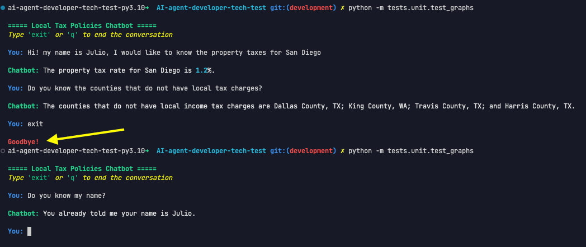
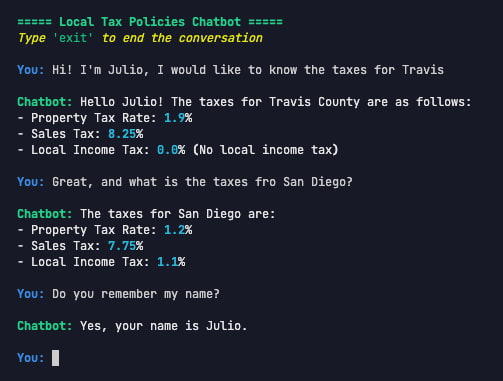
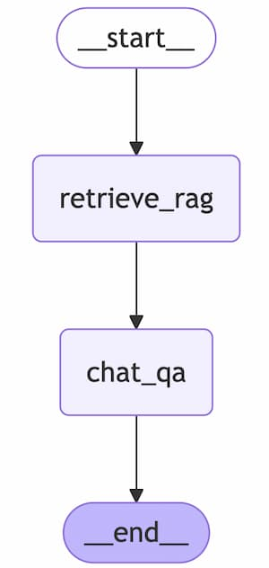

# AI-agent-developer-tech-test

## Short Summary
This project is a technical test that implements a chatbot with **Retrieval Augmented Generation (RAG)** capabilities using modern natural language processing technologies, it also have Long Term **Memory**. The project follows **Clean Architecture** and a **hybrid Hexagonal Architecture**, ensuring that the code is easily scalable and maintainable by using test and linters.

## Implementation Demonstrations
In the following image, the chatbot is interacted with to ask for tax information, the chatbot is closed, and then reopened. The chatbot remembers the context from the previous conversation.


In the next image, another example of interaction with the chatbot.


## Technologies Used
- **LangChain**: Framework for building applications with LLMs
- **LangGraph**: Library for creating workflows with LLMs
- **ChromaDB**: Vector database for local embedding storage
- **SQLite**: Relational database for chat message persistence
- **Rich**: Library for enhanced CLI interfaces
- **OpenAI**: Integration with advanced language models
- **Pydantic**: Data validation and schemas
- **Python**: Base programming language

## What Could Be Improved with More Time

1. **Refining the Graph**: Introduce a "router" node to decide whether the user's input should be responded to directly or go through the RAG process first, improving efficiency.

2. **Scalability and Deployment**: Prepare the application for deployment in scalable cloud environments (AWS, GCP), using Docker and Kubernetes. Consider using AWS Lambda or FastAPI for API endpoints.

3. **Contextual Learning**: Implement a more advanced memory system, such as MemoryDB, to allow the chatbot to learn and improve its responses over time.

4. **Expanded Testing**: Increase test coverage to include edge cases, error handling, and integration tests, ensuring robustness.

5. **Better Error Handling**: Improve fault tolerance with more granular error handling, especially when interacting with external services like OpenAI or ChromaDB.


## Project Structure
The project follows Clean Architecture and a hybrid of Hexagonal Architecture, which helps the code evolve easily. The directory structure is as follows:
```plaintext
AI-agent-developer-tech-test/
├── LICENSE                      # License file for the project
├── Makefile                     # Automates common project tasks
├── README.md                    # Project documentation
├── data/
│   ├── chroma_db_2/             # ChromaDB vector database
│   └── local_tax_policies.csv   # Sample data for local tax policies
├── poetry.lock                  # Poetry lock file for dependency versions
├── pyproject.toml               # Defines dependencies with Poetry
├── requirements.txt             # Lists project dependencies for installation
├── src/
│   ├── __init__.py              # Initializes the `src` package
│   ├── application/
│   │   ├── __init__.py          # Initializes the `application` package
│   │   ├── dto/                 # Data Transfer Objects
│   │   ├── graphs/              # Defines LangGraph workflows
│   │   │   ├── __init__.py
│   │   │   └── chat_graph.py    # Main chat graph definition
│   │   ├── nodes/               # Nodes for the workflow
│   │   │   ├── __init__.py
│   │   │   ├── chat_nodes.py    # Node for handling user queries and responses
│   │   │   └── rag_nodes.py     # Node for retrieving documents from the vector database
│   │   ├── prompts/             # Prompt templates for the chatbot
│   │   │   └── chat_prompts.py
│   │   └── services/            # Application services
│   │   │   ├── vector_ingest_service.py  # Service for ingesting documents into the vector database
│   │   │   └── vector_search_service.py  # Service for searching relevant documents in the vector database
│   │   └── use_cases/           # Application use cases
│   │       └── call_graph.py    # Use case for interacting with the chatbot
│   ├── core/
│   │   ├── __init__.py          # Initializes the `core` package
│   │   ├── logging.py           # Logging configuration
│   │   └── settings.py          # Application settings
│   ├── domain/
│   │   ├── __init__.py          # Initializes the `domain` package
│   │   ├── models/              # Domain models
│   │   │   ├── __init__.py
│   │   │   └── chat_state.py    # Defines the state model for the chat
│   │   ├── repositories/       # Repositories for interacting with the vector database
│   │   │   ├── __init__.py
│   │   │   └── vector_db_repository.py  # Interface for vector DB interaction
│   │   └── services/            # Domain services
│   │       └── __init__.py
│   ├── infrastructure/          # Infrastructure code
│   │   ├── __init__.py          # Initializes the `infrastructure` package
│   │   ├── llm/                 # Wrappers for language models
│   │   │   └── openai_wrapper.py  # Wrapper for OpenAI API
│   │   ├── tools/               # Custom tools
│   │   │   ├── __init__.py
│   │   │   └── chat_qa_tool.py  # Tool for answering questions using LangChain BaseTool
│   │   └── vectorstore/         # Code for managing the vector database
│   │       ├── __init__.py
│   │       └── chroma_repository.py  # ChromaDB repository implementation
│   └── setup/                   # Setup and initialization scripts
│       ├── __init__.py
│       ├── ingest_vectorstore.py  # Script to load data into the vector store
│       └── init_all.py          # Initializes all components of the system
├── static/                    # Static assets for documentation
└── tests/
    ├── __init__.py
    ├── conftest.py             # Test configurations
    └── integration/            # Integration tests
        ├── __init__.py
        └── test_graphs.py      # Unit and integration tests for test the created langgraphs
 ```

## Main Features

### Used dataset
The project uses a sample dataset of local tax policies, which is located in the [data/local_tax_policies.csv](./data/local_tax_policies.csv)

### RAG with ChromaDB
The system implements a **Retrieval Augmented Generation (RAG)** mechanism using ChromaDB as a local vector database. This enables:

- Efficient storage of embeddings
- Semantic search of relevant documents
- Context retrieval to improve LLM responses

### Persistent Memory with SQLite
The application uses **SQLite** for long-term message persistence, allowing:

- Storage of full conversations
- Retrieval of chat history
- Contextual conversation between sessions

### Workflow with LangGraph
The system implements a workflow using **LangGraph**, consisting of the following nodes:

1. **__start__**: Entry point into the graph
2. **retrieve_rag**: Retrieves relevant documents based on the user's query
3. **chat_qa**: Generates responses using the retrieved context
4. **__end__**: Exit point of the graph

### Custom Tools
The project uses custom tools created through LangChain’s **BaseTool** subclass, which provides:

- Greater flexibility in implementation
- Smooth integration with the LangChain ecosystem
- Easily extendable functionality

### CLI Interface with Rich
The application uses **Rich** to create an enhanced command-line interface with:

- Rich text formatting
- Improved user experience in the terminal
- Clear information display

## Graph Implementation
The project implements a workflow graph using LangGraph, as shown in the image below:



This flow allows:

1. Starting the conversation
2. Retrieving relevant documents based on the user's query
3. Generating contextualized responses
4. Finalizing the process

## Getting Started (Setup instructions)
To run this project, follow these detailed steps:

### 1. Clone the repository
First, clone the repository to your local machine:

```
git clone https://github.com/your_username/ai-agent-developer-tech-test.git
cd ai-agent-developer-tech-test
```

### 2. Install dependencies with Poetry
This project uses **Poetry** for dependency management. If you don't have **Poetry** installed, you can install it by running:

Install **Poetry**:
If you don't have **Poetry** installed, you can install it by running:

```
curl -sSL https://install.python-poetry.org | python3 -
```

Once **Poetry** is installed, navigate to the project folder and run:

```
poetry install
```

This will install all the necessary dependencies defined in the `pyproject.toml` file.

### 3. Configure environment variables
The project requires some environment variables to work correctly, especially those related to **OpenAI** integration.

If not exist create a `.env` file in the root of the project and add the following variables:

> [!IMPORTANT]  
> Be sure to replace `your_openai_api_key` with your actual OPENAI_API_KEY.

```
OPENAI_API_KEY=
LLM_MODEL_NAME=gpt-4.1-nano
EMBEDDING_MODEL=text-embedding-3-small
```

### 4. Activate the virtual environment with Poetry
To activate the virtual environment managed by **Poetry**, run:

```
poetry shell
```

This will activate the virtual environment, and you can run the project commands within this isolated environment.

### 5. Running the application
Once the virtual environment is activated, you can run the application using the following command:
```
make run
```
This will execute the following command:
```
python -m src.application.use_cases.call_graph
```

This will start the application, and you can interact with the chatbot.

### 6. Running Tests (Optional)
To run the tests, use the **Makefile** commands. This will execute the tests defined in the `tests/` folder:

```
make test
```

This will execute the following command:

```
poetry run pytest tests/integration/test_graphs.py
```

### 7. Populate the vector store (Optional)
If you'd like to recreate the vector store (which is already included in the repository), you can use the following command from the **Makefile** to populate it:

```
make populate_vector_store
```

This will execute the following command:

```
python -m src.setup.ingest_vectorstore
```

However, note that the vector store already exists in the repository as `data/chroma_db_2`, so this step is not necessary unless you want to recreate it.

## Contributions
This project is a technical test and is not open for external contributions.

## License
This project is licensed under the Apache License 2.0. See the [LICENSE FILE](./LICENSE) file for more details.
